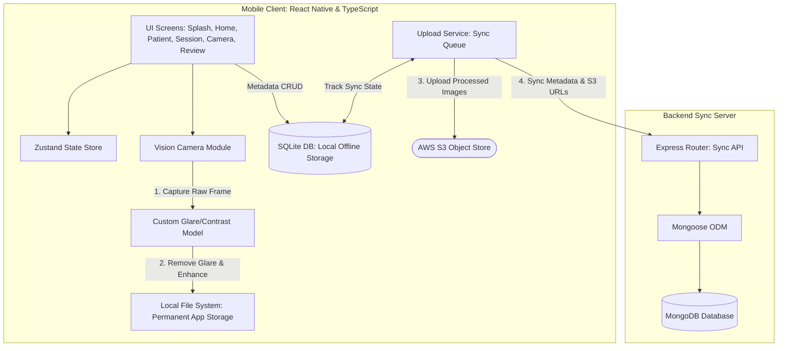

# Architecture Documentation: Smartphone Fundus Camera & AI-Ready Teleophthalmology Platform

This document outlines the architecture, components, data flows, and implementation details of the FundusPro system.

---

## 🗺️ System Overview

The FundusPro platform is designed to assist ophthalmologists and clinical operators in capturing high-definition fundus images using a smartphone-attached ophthalmoscope. 

The system relies on an **offline-first** design to ensure functionality in regions with unstable internet connectivity. 
- **Metadata Storage**: Managed on-device via SQLite and synchronized with a cloud-based **MongoDB** backend via Express.
- **Image Storage**: Binary image assets are uploaded to an **AWS S3 Object Store**. S3 object URLs are stored in MongoDB.
- **AI Processing**: Captured raw frames are pushed to a custom glare/contrast correction model. The processed images are then stored permanently on the mobile device's local storage and queued for S3 sync.



---

## 📱 Frontend Architecture (React Native)

The mobile client is built using React Native, TypeScript, and React Navigation. It leverages a layered architecture that segregates UI screens from global state, services, and native data adapters.

### 1. Folder Structure & Modularization

```text
src/
├── components/          # Reusable presentation controls
│   ├── Button.tsx       # Standard themed action button
│   ├── Input.tsx        # Styled form inputs
│   ├── Card.tsx         # Content container panels
│   └── EyeSelector.tsx  # Eye side selector (OS vs. OD toggle)
├── constants/
│   └── theme.ts         # Color palette, spacing, and typography configuration
├── database/
│   └── SQLiteService.ts # SQLite client abstraction and local database operations
├── models/
│   └── types.ts         # TypeScript schema interfaces (Patient, Session, Image, Upload)
├── navigation/
│   ├── AppNavigator.tsx # React Navigation Stack configurations
│   └── types.ts         # Navigation route parameter specifications
├── screens/             # Screen controllers
│   ├── SplashScreen.tsx       # App initialization
│   ├── HomeScreen.tsx         # Dashboard quick actions
│   ├── PatientDetailsScreen.tsx # Patient registration form
│   ├── SessionScreen.tsx      # Current active session manager
│   ├── CameraScreen.tsx       # Custom camera viewport & controls
│   ├── ImageReviewScreen.tsx  # Capture verification and action console
│   ├── GalleryScreen.tsx      # Sync history list
│   └── SettingsScreen.tsx     # Admin panel (database wipe, sync retry)
├── services/            # Background utilities and third-party integrations
│   ├── FileService.ts         # Local file system movements (react-native-fs wrapper)
│   ├── AIEnhancementService.ts # Local/remote model processing scheduler
│   └── UploadService.ts       # Offline-resilient S3 upload queue manager
└── store/
    └── useAppStore.ts   # Zustand store for lightweight, in-memory state
```

### 2. Local State Management (Zustand)

Global frontend state is managed via [useAppStore.ts](file:///home/siddhant/projects/capstone/src/store/useAppStore.ts) to share data easily between screens during an active session.
- **Current State**: Keeps track of `currentPatient`, `currentSession`, and `sessionCaptures` (array of `CaptureImage` objects).
- **Actions**: Provides setters (`setCurrentPatient`, `setCurrentSession`), appends (`addSessionCapture`), and item updates (`updateSessionCapture`).

### 3. Local SQLite Database & Schemas

The local SQLite database in [SQLiteService.ts](file:///home/siddhant/projects/capstone/src/database/SQLiteService.ts) provides persistent offline storage with the following schemas:
* **`patients`**: Stores patient demographics (`id` as primary key, `name`, `gender`, `dob`, external `patientId`, `notes`, `createdAt`).
* **`sessions`**: Groups imaging events (`id` as primary key, `patientId` as foreign key, `notes`, `createdAt`, `updatedAt`).
* **`captures`**: Links captured image paths and sync states (`id` as primary key, `sessionId`, `patientId`, `eyeSide`, `rawImagePath`, `enhancedImagePath`, `captureTime`, `uploadStatus`, `enhancementStatus`, `qualityScore`, `notes`, `metadata`).
* **`upload_queue`**: Manages background synchronization tasks (`id` as primary key, `imageId`, `status` as pending/processing/failed, `retryCount`, `lastAttemptAt`, `errorMessage`).

- **Client-Generated IDs**: To support offline creation, all record IDs are generated on-client (e.g. UUIDs). When synchronized, the backend uses these client-generated IDs as MongoDB primary keys (`_id`), maintaining referential integrity without round-trips.

---

## 🔄 Image Capture & AI Processing Pipeline

The pipeline is designed to execute immediately after the capture event, preserving both the raw and enhanced images:

1. **Capture Event**:
   - The user triggers capture on [CameraScreen.tsx](file:///home/siddhant/projects/capstone/src/screens/CameraScreen.tsx).
   - `react-native-vision-camera` outputs a temporary raw image file path.

2. **Model Processing**:
   - The client pushes the raw frame data to the cloud glare-correction API (`POST /api/enhance/glare`) via [AIEnhancementService.ts](file:///home/siddhant/projects/capstone/src/services/AIEnhancementService.ts).
   - The cloud model processes the raw image, corrects glare/contrast, and returns the enhanced image payload.

3. **Permanent Mobile Storage**:
   - The original raw image is saved permanently to local device storage using [FileService.ts](file:///home/siddhant/projects/capstone/src/services/FileService.ts) as `raw_[sessionId]_[eyeSide]_[timestamp].jpg`.
   - The processed image is saved permanently as `enhanced_[sessionId]_[eyeSide]_[timestamp].jpg`.
   - A `CaptureImage` record is created in SQLite holding local disk paths for **both** the raw and enhanced files.

4. **Dual S3 Upload & Backend Sync**:
   - [UploadService.ts](file:///home/siddhant/projects/capstone/src/services/UploadService.ts) fetches separate presigned S3 URLs from the backend for both files.
   - Uploads both the raw and enhanced JPEGs directly to **AWS S3** via PUT requests.
   - Once S3 returns the upload object links, both S3 URLs (`rawImageUrl` and `enhancedImageUrl`) are synchronized to the Express backend and saved to MongoDB.

---

## 🗄️ Backend Architecture (Express & MongoDB)

The sync backend is built with Express, TypeScript, and the Mongoose ODM to interface with MongoDB.

### 1. Mongoose Schemas & Models (`backend/src/models/`)

To support offline-first sync operations, document schemas explicitly define `_id` as a `String` (instead of the default MongoDB `ObjectId`). This allows the mobile client to generate UUIDs offline, ensuring consistency when synchronized.

#### Patient Schema (`backend/src/models/Patient.ts`)
```typescript
import mongoose, { Schema, Document } from 'mongoose';

export interface IPatient extends Document {
  _id: string; // Client-generated UUID
  name: string;
  gender: string;
  dob: Date;
  patientId?: string; // Optional external clinical ID
  notes?: string;
  createdAt: Date;
}

const PatientSchema: Schema = new Schema({
  _id: { type: String, required: true },
  name: { type: String, required: true },
  gender: { type: String, required: true },
  dob: { type: Date, required: true },
  patientId: { type: String, unique: true, sparse: true },
  notes: { type: String },
  createdAt: { type: Date, default: Date.now }
});

export const PatientModel = mongoose.model<IPatient>('Patient', PatientSchema);
```

#### Session Schema (`backend/src/models/Session.ts`)
```typescript
import mongoose, { Schema, Document } from 'mongoose';

export interface ISession extends Document {
  _id: string; // Client-generated UUID
  patientId: string; // References Patient._id
  notes?: string;
  createdAt: Date;
  updatedAt: Date;
}

const SessionSchema: Schema = new Schema({
  _id: { type: String, required: true },
  patientId: { type: String, required: true, ref: 'Patient' },
  notes: { type: String },
  createdAt: { type: Date, default: Date.now },
  updatedAt: { type: Date, default: Date.now }
});

export const SessionModel = mongoose.model<ISession>('Session', SessionSchema);
```

#### CaptureImage Schema (`backend/src/models/CaptureImage.ts`)
```typescript
import mongoose, { Schema, Document } from 'mongoose';

export interface ICaptureImage extends Document {
  _id: string; // Client-generated UUID
  sessionId: string; // References Session._id
  patientId: string; // References Patient._id
  eyeSide: 'left' | 'right';
  rawImageUrl: string; // S3 Bucket location
  enhancedImageUrl?: string; // S3 Bucket location (enhanced image)
  captureTime: Date;
  enhancementStatus: 'not_started' | 'queued' | 'processing' | 'done' | 'failed';
  qualityScore?: number;
  notes?: string;
  metadata?: Record<string, any>;
}

const CaptureImageSchema: Schema = new Schema({
  _id: { type: String, required: true },
  sessionId: { type: String, required: true, ref: 'Session' },
  patientId: { type: String, required: true, ref: 'Patient' },
  eyeSide: { type: String, enum: ['left', 'right'], required: true },
  rawImageUrl: { type: String, required: true },
  enhancedImageUrl: { type: String },
  captureTime: { type: Date, required: true },
  enhancementStatus: { type: String, default: 'not_started' },
  qualityScore: { type: Number },
  notes: { type: String },
  metadata: { type: Schema.Types.Mixed }
});

export const CaptureImageModel = mongoose.model<ICaptureImage>('CaptureImage', CaptureImageSchema);
```

### 2. AWS S3 Presigned URL Flow

To upload images securely from the mobile client to AWS S3 without exposing credentials:
1. Mobile app requests a presigned URL from the backend: `GET /api/upload/presign?filename=enhanced_xyz.jpg`.
2. Backend generates a presigned PUT URL using the AWS SDK and returns it to the client.
3. Mobile app uploads the image binary directly to AWS S3 via a `PUT` request.
4. Mobile app upserts the capture metadata to the backend `POST /api/sync/capture` including the final S3 object URL.

### 3. Cloud AI Classification Flow

To assist in clinical diagnostics, the backend triggers automated classification once image metadata is synchronized:
1. When `POST /api/sync/capture` is called and contains the `enhancedImageUrl`, the backend retrieves the associated `Patient` details (DOB/age, gender) and camera telemetry metadata (zoom).
2. It forwards this combined clinical context package to the **Cloud Disease Classification Model**.
3. The classifier returns a predicted diagnosis (e.g. `Healthy Retina`, `Diabetic Retinopathy`) and a prediction confidence score.
4. The backend saves these results directly in the MongoDB document's `diagnosisResult` and `confidenceScore` fields.

---

## 🔄 Core Data Sync Flow

```text
[Camera Screen]
       │
       ▼ (1) Take Photo
[Raw JPEG in Temp Storage]
       │
       ▼ (2) Glare & Contrast Correction Model
[Processed Clinical Image]
       │
       ▼ (3) Save permanently to device storage (FileService)
[Enhanced JPEG saved on Mobile]
       │
       ▼ (4) Save record to local SQLite (dbService)
[Local SQLite Sync Queue Registered]
       │
 ┌─────┴───────────────────────────────────────────────────────┐
 │                                                             │
 ▼ (5) Request S3 Presigned URL                                ▼ (5) Sync Demographics
[GET /api/upload/presign]                                [POST /api/sync/patient & session]
 │                                                             │
 ▼ (6) Upload Image Binary directly to S3                      ▼ (6) Upsert in MongoDB
[PUT to AWS S3 bucket]                                    [Patient & Session updated]
 │                                                             │
 ▼ (7) Upload complete -> Get S3 URL                           │
[S3 URL = https://bucket.s3.amazonaws.com/...]                 │
 │                                                             │
 └─────┬───────────────────────────────────────────────────────┘
       │
       ▼ (8) Sync Capture Metadata (with S3 URL)
[POST /api/sync/capture]
       │
       ▼ (9) Express Backend Upsert
[Save image details in MongoDB]
```

---

## 📋 Implementation Roadmap & Status

Below is the implementation status of the system features, tracking completed milestones and detailing active tasks for upcoming phases.

### Phase 1: Clinical Camera Controls [Status: COMPLETED ✅]
* **Max Permission Handlers**: Runtime camera permissions requested dynamically at startup.
* **Dynamic Device Query**: Fallback sequence implemented: checks for `telephoto-camera` -> `wide-angle-camera` -> any `back` camera -> first available camera to avoid crashes on diverse devices.
* **Tap-to-Focus Integration**: Touch handler in [CameraScreen.tsx](file:///home/siddhant/projects/capstone/src/screens/CameraScreen.tsx) maps layout taps into normalized `(x, y)` coordinate values from `0.0` to `1.0`.
* **Continuous Illumination**: Standard flash replaced with continuous LED `torch` state (`on` | `off`) to allow alignment under continuous light.

### Phase 2: Database Migration (MongoDB & Mongoose) [Status: COMPLETED ✅]
* **Prisma Removal**: Uninstall `prisma` and `@prisma/client` from backend dependencies, delete the `prisma/` folder and database pushing commands.
* **Mongoose Integration**: Install `mongoose` and `@types/mongoose` in the backend. Configure a MongoDB container instance in [docker-compose.yml](file:///home/siddhant/projects/capstone/docker-compose.yml).
* **Mongoose Models**: Write models mapping schemas for `Patient`, `Session`, and `CaptureImage` with string primary keys (`_id`) to support offline UUID synchronization.
* **API Endpoints Refactor**: Connect to MongoDB at startup and replace Prisma client operations in [index.ts](file:///home/siddhant/projects/capstone/backend/src/index.ts) with Mongoose `findOneAndUpdate` upserts.

### Phase 3: AWS S3 Object Storage [Status: COMPLETED ✅]
* **S3 Presigned URLs Endpoint**: Add `@aws-sdk/client-s3` and `@aws-sdk/s3-request-presigner` to backend dependencies. Implement the `GET /api/upload/presign` endpoint in [index.ts](file:///home/siddhant/projects/capstone/backend/src/index.ts) to generate temporary S3 PUT authorization links.
* **Direct Client Uploads**: Configure [UploadService.ts](file:///home/siddhant/projects/capstone/src/services/UploadService.ts) to query the presigned URL, upload the image binary directly to S3 via a PUT request, and sync the returned S3 URL in capture metadata.

### Phase 4: Image Capture & Glare Correction Pipeline [Status: COMPLETED ✅]
* **Camera Capture Handler**: Save the raw captured frame permanently and trigger the glare correction model immediately.
* **Dual Local Preservation**: Save the model's processed output as the enhanced clinical image via [FileService.ts](file:///home/siddhant/projects/capstone/src/services/FileService.ts), retaining both the raw and enhanced JPEGs on the mobile device disk.
* **Dual AWS S3 Synchronization**: Update [UploadService.ts](file:///home/siddhant/projects/capstone/src/services/UploadService.ts) to upload both files to S3 and synchronize their respective S3 URLs (`rawImageUrl` and `enhancedImageUrl`) to MongoDB.

### Phase 5: Production-Grade Offline SQLite DB [Status: COMPLETED ✅]
* **Native SQLite integration**: Swap database mock layers in [SQLiteService.ts](file:///home/siddhant/projects/capstone/src/database/SQLiteService.ts) with `react-native-sqlite-storage` or `expo-sqlite`.
* **State synchronization**: Bind SQL database writes with the global state in [useAppStore.ts](file:///home/siddhant/projects/capstone/src/store/useAppStore.ts).

### Phase 6: Verification & End-to-End Testing [Status: COMPLETED ✅]
* **Full Pipeline Verification**: Verify patient registration -> capture -> model correction -> SQLite write -> S3 upload -> MongoDB synchronization behaves correctly under simulated offline and online transitions.
